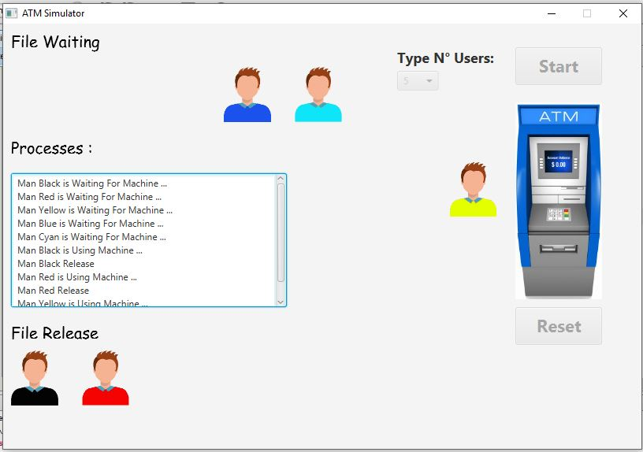

# ATM Simulator
Used the notion of threads and parallelism to make a basic **ATM Simulator**.

### Screenshoot
ATM Simulator          |
:---------------------:|

### Goal of Project 💡
Get knowledge how to use threads in java and how to manage threads by using semaphores and different kind of mutual exclusion to protect critical sections

### Requirements 🔧
* Java version 8 or higher.

### Installation 🔌
1. Press the **Fork** button (top right the page) to save copy of this project on your account.

2. Download the repository files (project) from the download section or clone this project by typing in the bash the following command:

       git clone https://github.com/HouariZegai/ATMSimulator.git
3. Imported it in Intellij IDEA.
4. Run the application :D

### Contributing 
If you want to contribute to this project and make it better with new ideas, your pull request is very welcomed.
If you find any issue just put it in the repository issue section, thank you.
